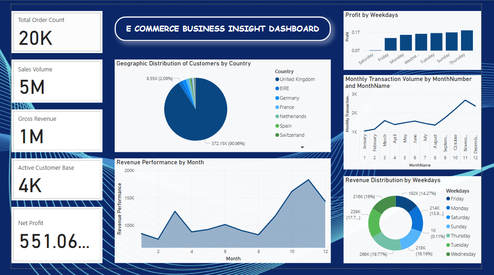
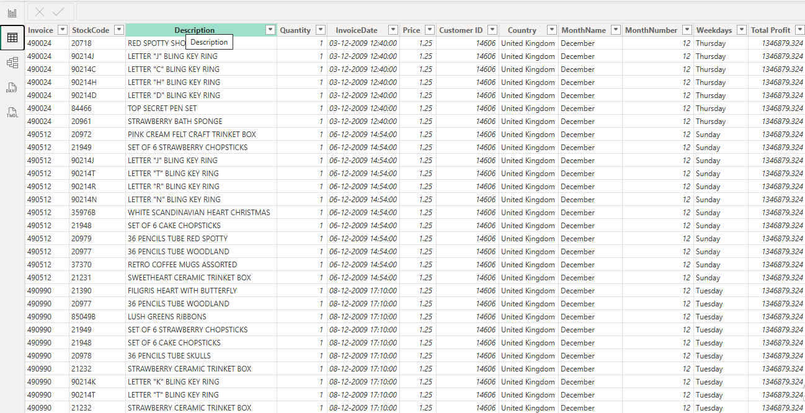
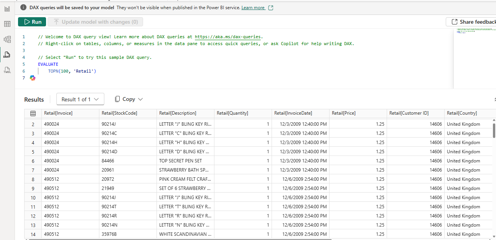

# 📊 E-Commerce Business Insight Dashboard using Power BI

## ✅ Project Overview
This project presents a fully developed **E-Commerce Business Insight Dashboard** built using **Microsoft Power BI**, based on a retail transaction dataset sourced from Kaggle. The dashboard transforms raw sales data into meaningful business insights, enabling the analysis of revenue patterns, customer distribution, profitability trends, and order activity across time.

This project demonstrates:
- Data cleaning and preparation
- Data modelling and DAX measures
- KPI creation for business monitoring
- Trend and comparative visual analytics
- Dashboard layout and insight storytelling

---

## 👤 Developed By
**Amarjith Anand**  
MCA Student  
College of Engineering, Trivandrum

---

## 📥 Dataset Source
Kaggle – Retail Transaction Dataset  
(Contains invoices, quantities, customer IDs, dates, countries, and revenue fields)

Dataset Link:  
🔗 https://www.kaggle.com/datasets

---

## 📂 Repository Contents
```
📁 FUTURE_DS_01
├─ 
├─ 📁 Dashboard
│   └─ PowerBI_Dashboard.pbix
│
├─ 📁 Screenshots
│   ├─ Dashboard_Main_View.png
│   ├─ PowerBI_TableView.png
│   ├─ PowerBI_DAX_Query_View.png
│   └─ Excel_Raw_Data_View.png
├─ 📁 Docs
│   └─ Project_Documentation.pdf
├─ 📁 Dataset
│   └─ Retail_Sales_Dataset.xlsx
│
└─ README.md
```

---

## 🧠 Key Dashboard Features
✅ KPI Metrics  
- Total Order Count  
- Sales Volume  
- Gross Revenue  
- Active Customer Base  
- Net Profit  

✅ Visual Components  
- Customer Distribution by Country  
- Monthly Revenue Trend  
- Monthly Transaction Volume  
- Weekday Revenue Comparison  
- Weekday Profit Performance  

✅ Business Insights Identified  
📌 November recorded peak revenue  
📌 Fridays show highest profit levels  
📌 UK has the largest customer share  
📌 Order volume increases toward year-end  

---

## 🧩 Tools and Technologies Used
| Component | Technology |
|-----------|------------|
| Data Source | Excel |
| BI Platform | Microsoft Power BI |
| Calculation Language | DAX |
| Dataset Origin | Kaggle |
| Modeling | Calendar, Metrics, Aggregation |

---

## 🧮 DAX Measures Included
```
Total_Order_Count.dax
Sales_Volume.dax
Gross_Revenue.dax
Active_Customer_Base.dax
Net_Profit.dax
Monthly_Revenue_Trend.dax
Weekday_Profit.dax
```

---

## 📝 Documentation
Full project documentation including:

✅ Abstract  
✅ Introduction  
✅ Problem Statement  
✅ Objectives  
✅ Methodology  
✅ Dashboard Explanation  
✅ Findings & Insights  
✅ Conclusion  
✅ Future Enhancements  

Download here:  
📄 **Project Documentation (PDF)**  
(Insert file link after upload)

---

## 🖼 Dashboard Preview Screenshots

### 📌 Main Dashboard View


### 📌 Power BI Table View


### 📌 DAX Query Output


### 📌 Dataset Preview


---

## 🚀 Future Enhancements
✅ Product category performance  
✅ Forecasting models  
✅ Drill-downs and slicers  
✅ Real-time data refresh  
✅ Automated report distribution  

---

## 📣 Usage Permissions
This project may be used for:

✅ Learning  
✅ Academic submission  
✅ Internship portfolio  

Please credit the author when referencing.

---

## ⭐ If you found this useful
Feel free to:
✅ Star ⭐ the repository  
✅ Fork and extend  
✅ Share feedback  
✅ Connect on LinkedIn  

